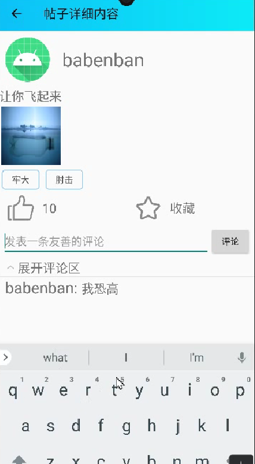

<<<<<<< HEAD
梗指北——一个网络热梗分享平台
1.系统处理流程
在程序逻辑设计中，尤为关键的功能是智能推送算法的设计。通过加权标签、Jaccard相似度衡量、哈希表等方法，我们实现智能推送算法，可以为每个用户推送最相关的内容，从而提高用户的满意度和留存率。
使用哈希表实现核心的相似度计算功能：
 
算法思路：
根据用户点赞的帖子的标签，绘制用户画像（具体表现为用户自身的标签序列）。
将所有可推送的帖子（用户未浏览过）按点赞数逆序排序，依次与用户标签进行Jaccard相似度的计算，若是相似度>0.8则直接进入推送序列，否则将此贴放入等待队列，推送序列帖子数目不足时用于补齐。
因此，此推送算法实现了相似度优先、点赞数其次的推送机制，同点赞数情况下优先推送相似度高的，同相似度情况下优先推送点赞数高的帖子。
 

图1 算法流程图

2.系统登录界面
本系统使用数据库技术，通过用户名和密码对用户身份进行核实，从而保障用户和软件的权益。点击软件图标即可打开系统并进入到系统登录界面，如图2所示。

图2 登录界面

登录界面由四个部分组成，包括用户名和密码的输入框、登录按钮、记住密码可选框以及自动登录可选框按钮。在用户名和密码的输入框中输入正确的用户名和密码，单击登录按钮即可进入系统。如果用户输入为空内容或者用户名与密码不匹配，则无法登录。与此同时，你可以勾选记住密码多选框和自动登录多选框，以便在下次进入app的时候完成自动登录。
3.注册账号界面
 

如果没有账号，则可以在这里进行注册，输入符合要求的用户名，密码，再进行一遍密码确认，就可以完成账号的注册了，当完成账号的注册后，返回登录界面，就可以利用刚才注册的账号登录

3.系统主界面（梗指北）
登录成功后即进入系统的主界面，主界面主要包含切换上一条、切换下一条、点赞、收藏四大功能按钮，首页还会展示系统根据个人标签专门为你量身定做的推送内容。通过点击【梗百科】按钮可跳转至相应界面，点击【什么梗】进入发帖界面。点击系统推送帖子进入帖子详情界面，如图3所示。

图3 系统主界面

其中，点击【切换上一条】或【切换下一条】按钮进行推荐帖子的切换，推荐帖子也会自动进行轮换；点击【收藏】按钮将进行收藏；点击【点赞】按钮将点赞，并且一直显示点赞数。

4.	搜贴
通过搜索框输入搜索内容，即可根据帖子的内容进行搜索，并可以点击并查看具体的帖子，如图4所示。

图4 查贴

5.	评论
  点击帖子，可查看帖子的具体内容，以及帖子下面的所有评论，同时还可以对帖子进行点赞和收藏，同时你也可在此界面对帖子进行评论回复。如图5所示。

图5 评论

6.	侧栏
侧栏显示用户图像、用户名和用户签名，并有个人中心、我的专属词云、我的收藏、修改资料四大功能按钮。如图6所示。

图6 侧栏

其中，点击【个人中心】、【我的收藏】、【修改资料】、【我的专属词云】可进入相应功能界面。

7.	梗百科
  点击【梗百科】按钮进入看帖页面。看帖页面有已解决和未解决两大界面，各界面显示相应的帖子。如果7所示。
 

图7 梗百科

其中，点击【已解决】进入显示已解决的帖子的界面，点击【未解决】进入显示未解决的帖子的界面。
8.	发帖
点击【什么梗】符号，进入发帖界面，由帖子内容输入框，视频添加符号、标签可选框、返回功能符号、发帖功能符号组成。如图8所示。

图8 发帖

点击➕ 符号可以添加本地图片、点击标签框可以选择标签、点击返回⬅ 符号可以返回主界面、点击【发帖】可以发送帖子。
9.词云
  点击侧栏中【我的专属词云】可以进入我的词云界面，此界面主要由返回功能符号和词云组成。在此界面可以查看系统根据用户浏览历史记录给每个用户生成的专属的，独一无二的词云，如图9所示。

图9 我的词云

其中点击返回⬅ 符号可以返回主界面。

10.精选评论

图10 设置精选评论

在此界面可以对帖子设置精选评论，在帖子内容的下方可以查看该贴的所有评论，点击你最感兴趣的评论，使其成为精选评论，当设置精选评论后，帖子就将从【未解决】状态变成【已解决】状态

=======
# Meme-Guide---A-Platform-for-Sharing-Trending-Internet-Memes
>>>>>>> 4175eba (Initial commit)
